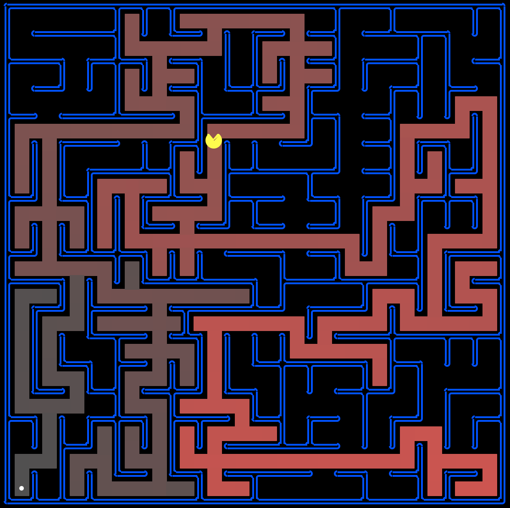
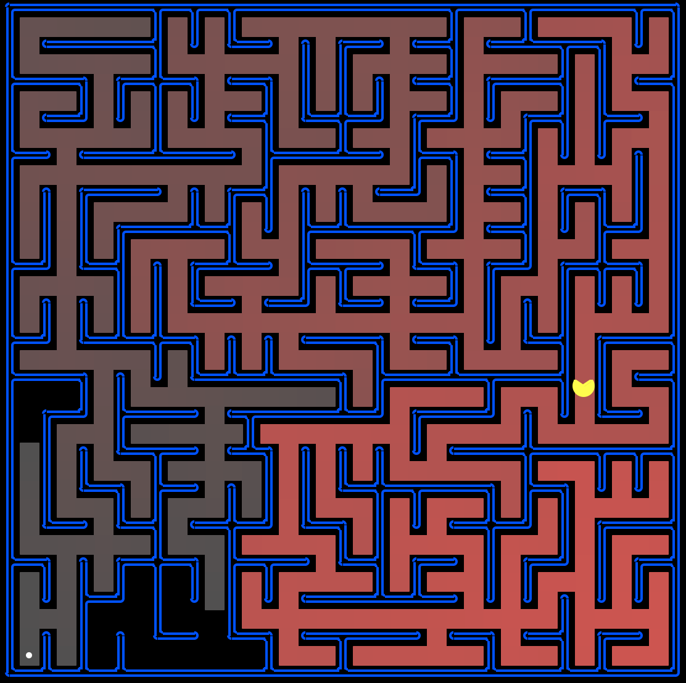

# Pacman
2018.12.4

In this project, the Pacman agent will find paths through his maze world, both to reach a particular location and to collect food efficiently. We will build general search algorithms and apply them to Pacman scenarios.

#### DFS

Depth-first search (DFS) is an algorithm for traversing or searching tree or graph data structures. The algorithm starts at the root node (selecting some arbitrary node as the root node in the case of a graph) and explores as far as possible along each branch before backtracking ([wiki](https://en.wikipedia.org/wiki/Depth-first_search)).

#### BFS

Breadth-first search (BFS) is an algorithm for traversing or searching tree or graph data structures. It starts at the tree root (or some arbitrary node of a graph), and explores all of the neighbor nodes at the present depth prior to moving on to the nodes at the next depth level ([wiki](https://en.wikipedia.org/wiki/Breadth-first_search)).

#### UCS / Dijkstra
Uniform cost search (UCS, aka Dijkstra's Algorithm) picks the node with the least cumulative cost (i.e. priority), and insert all children of the dequeued node, with the new cumulative cost as priority.

Source: https://inst.eecs.berkeley.edu/~cs188/fa18/project1.html